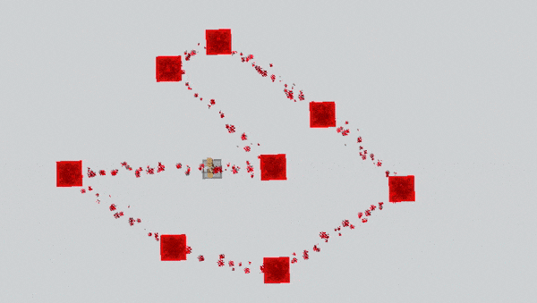

# Path

---


## Path



## Setting path nodes

Path nodes are targets where Taterzen will move.
To edit those, you need to enter the path editor by running
```
/npc edit path
```
*(To exit the editor, run the same command again.)*


### 1. Adding blocks

To add a block to path, simply left click on it. It will temporarily be switched to redstone block.

### 2. Removing blocks

To remove a block from path, right click on it.


## Clear whole path
To remove all nodes, run
```
/npc edit path clear
```
You'd probably want to set the movement to `NONE` as well.