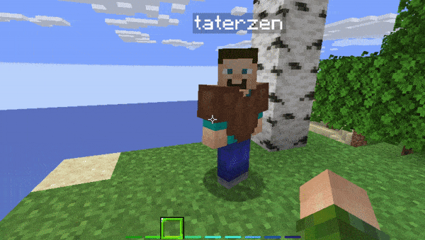

# Entity Types

---


## Changing the type of Taterzen

Taterzens mod supports all vanilla entities (except for fishing bober).
Modded ones *should* work as well.


To change the type of the Taterzen, simply use the following command
```
/npc edit type <entity type>
```